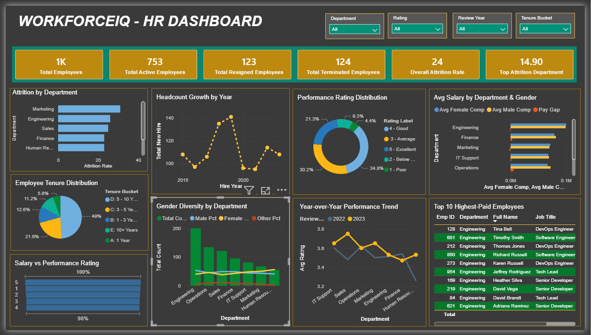

# WorkforceIQ — HR Analytics Dashboard

An end-to-end HR analytics project that tracks employee attrition, compensation, performance, diversity, and attendance using SQL for data analysis and Power BI for visualization.

## 📌 Overview

This project simulates a real-world HR analytics workflow: raw employee data is loaded into a PostgreSQL database, analyzed using SQL, and visualized in an interactive Power BI dashboard. The goal is to answer the kind of business questions an HR or People Analytics team would actually ask — who is leaving, who is underpaid, which departments struggle with attendance, and whether performance and pay are aligned.

## 🛠️ Tech stack

- **PostgreSQL** — data modeling and analysis
- **Power BI** — interactive dashboard and reporting
- **VS Code** —  environment for SQL development and script execution

<br>

## 📊 PowerBI Dashboard
 

<div align="center">
  
</div>

<br>

## Project workflow

```
Raw CSV data → PostgreSQL (table creation + import) → SQL analysis queries → Power BI (dashboard)
```

1. **Extract** — Raw HR data sourced as CSV files (employees, departments, salaries, performance, attendance)
2. **Load** — Created a normalized schema in PostgreSQL with 5 tables and foreign key relationships, then imported the CSV files using `VS code Terminal`
3. **Analyze** — 12 SQL queries written in PostgreSQL to answer specific HR business questions
4. **Visualize** — Each SQL query's result loaded directly into Power BI and mapped to a corresponding chart

<br>

## Dataset

| Table | Rows | Description |
|---|---|---|
| `employees` | 1,000 | Core employee master data (demographics, hire/exit dates, job title, status) |
| `departments` | 7 | Department reference table |
| `salaries` | 1,000 | Base salary and bonus per employee |
| `performance` | 2,000 | Annual performance ratings (2022–2023, scale 1–5) |
| `attendance` | 90,000 | Daily attendance records (Jan–Mar 2024) |

<br>

## Business questions answered (SQL queries)

Each query was designed to answer a specific HR business question, and each one feeds directly into a Power BI visual.


| # | Business question | Power BI visual |
|---|---|---|
| Q1 | What is the total and active headcount? | KPI card |
| Q2 | What is the overall attrition rate? | KPI card |
| Q3 | Which department has the worst attendance? | KPI card |
| Q4 | Which department has the highest attrition? | Clustered Bar chart |
| Q5 | Is the company's headcount growing year over year? | Line chart |
| Q6 | How is performance rating distributed across the workforce? | Donut chart |
| Q7 | Is there a pay gap by department and gender? | Clustered Bar chart |
| Q8 | How long do employees typically stay before leaving? | Pie chart |
| Q9 | Do higher performers earn more on average? | Funnel chart |
| Q10 | What is the gender diversity ratio per department? | Line and Clustered Column chart |
| Q11 | Has average performance improved year over year by department? | Line chart |
| Q12 | Who are the top 10 highest-paid active employees? | Table |


All 12 queries are available in [`/queries/all_queries.sql/`](./queries/all_queries.sql).

<br>

## 📊  Power BI integration

Each query's result set was loaded into Power BI as its own table using `**Get Data → PostgreSQL database → Advanced options**`, pasting the corresponding SQL query directly. No DAX measures or calculated columns were created — all aggregation and business logic happens at the SQL layer, and Power BI is used purely for visualization and interactivity (slicers, filters, drill-through).

<br>

## Repository structure

```
WorkforceIQ — HR Analytics Dashboard/
│
├── data/
│   ├── employees.csv
│   ├── departments.csv
│   ├── salaries.csv
│   ├── performance.csv
│   └── attendance.csv
│
├── queries/
│   ├── schema.sql
│   └── all_queries.sql
│
├── doc/
│   ├── schema.erd.json
│   └── workforceiq.pbix
│
├── LICENSE
│
└── README.md
```

<br>

## ⚙️ How to run this project

1.  Clone the repository
   ```
   git clone https://github.com/bithiNath/WorkforceIQ.git
   ```
2. Run `schema.sql` in PostgreSQL or VScode to create database and tables.
3. Import the CSV files from `/data` by using VS Code terminal:
   * Open the VS Code integrated terminal and connect to your PostgreSQL database using `psql`:
     ```bash
     psql -U your_username -d your_database_name
     ```
   * Run the following `\copy` command for each table (change table and file names accordingly):
     ```sql
     \copy table_name FROM 'data/your_file.csv' DELIMITER ',' CSV HEADER;
     ```
4. Run the queries in `queries/all_queries.sql` to verify the data.
5. View Dashboard Screenshots: open `doc/workforceiq.csv`

<br>

## 📜 License

This project is licensed under the MIT License - see the LICENSE file for details.

<br>

## 📬 Contact

- **GitHub:** [@bithiNath](https://github.com/bithiNath)
- **LinkedIn:** [Bithi Nath](https://linkedin.com/in/bithinath)

---

<br>

<p align="center">Developed by <a href="https://github.com/bithiNath">@bithiNath</a> ⚡</p>

